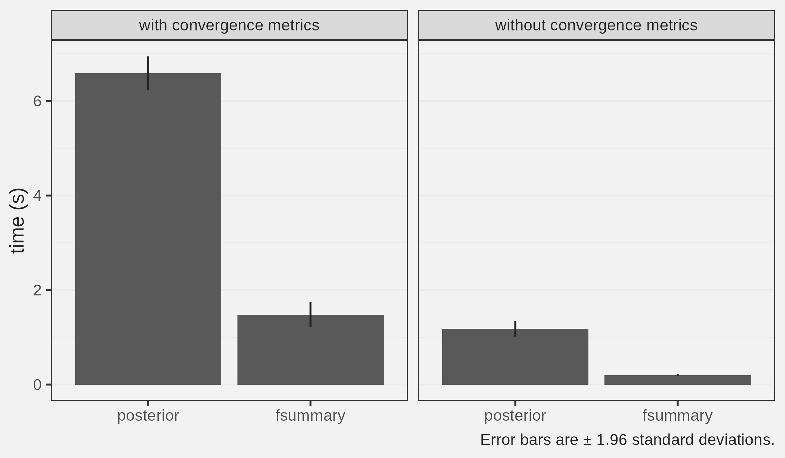

<!-- README.md is generated from README.Rmd. Please edit that file -->

```{r, include = FALSE}
knitr::opts_chunk$set(
  collapse = TRUE,
  comment = "#>",
  fig.path = "man/figures/README-",
  out.width = "100%"
)
```

# fsummary

<!-- badges: start -->
<!-- badges: end -->

The goal of fsummary is to compute posterior summaries from `cmdstanr` FAST!

## Installation

You can install the development version of fsummary from [GitHub](https://github.com/) with:

``` r
remotes::install_github("andrewGhazi/fsummary")
```

## Example

This package's main function, `fsummary()`, computes the same thing as `posterior::summarise_draws()`. Here we run it on on a simulated draws data frame `ddf`:

```{r example, message=FALSE}
library(fsummary)
library(collapse)
library(posterior)

options(digits = 3)

set.seed(123)

n_chain = 4
n_iter = 1000
n_var = 1000

ddf = rnorm(n_chain * n_iter * n_var) |> 
  matrix(ncol = 1000) |> 
  qDT() |> 
  mtt(`.draw` = 1:(n_iter*n_chain),
      `.iteration` = rep(1:n_iter, times = n_chain),
      `.chain` = rep(1:n_chain, each = n_iter)) |> 
  posterior::as_draws_df()

fsummary(ddf) |> head()
```

On one core, it's about 3 times faster than `summarise_draws()` when computing convergence metrics and 5-6 times faster without. A couple quick tests on my machine:

```{r, eval = FALSE}

check_fun = function(x,y) {
  check_res = waldo::compare(x, y, 
                             tolerance = 1e-6, ignore_attr = TRUE)
  length(check_res) == 0
}

bench::mark(fsummary = {fsummary(ddf)},
            posterior = {summarise_draws(ddf)},
            iterations = 10,
            check = check_fun,
            filter_gc = FALSE)

```

```
  expression      min median `itr/sec` mem_alloc `gc/sec` n_itr  n_gc total_time
  <bch:expr> <bch:tm> <bch:>     <dbl> <bch:byt>    <dbl> <int> <dbl>   <bch:tm>
1 fsummary      1.68s  1.73s     0.549     1.2GB     6.10    10   111     18.21s
2 posterior     6.03s  6.27s     0.158    5.13GB     4.43    10   281      1.06m
```

```{r, eval = FALSE}
bench::mark(fsummary = {fsummary(ddf,
                                 conv_metrics = FALSE)},
            posterior = {summarise_draws(ddf, 
                                         default_summary_measures())},
            iterations = 10,
            check = check_fun,
            filter_gc = FALSE)
```

```
  expression      min   median `itr/sec` mem_alloc `gc/sec` n_itr  n_gc total_time
  <bch:expr> <bch:tm> <bch:tm>     <dbl> <bch:byt>    <dbl> <int> <dbl>   <bch:tm>
1 fsummary   190.43ms 198.94ms     4.46     92.1MB     2.67    10     6      2.24s
2 posterior     1.09s    1.12s     0.822     759MB     4.85    10    59     12.17s
```



You can set up daemons with [`mirai`](https://shikokuchuo.net/mirai/index.html) for parallelization:

```{r eval=FALSE}
mirai::daemons(4)
system.time({fsummary(ddf)})
```
```
   user  system elapsed 
  0.018   0.012   1.227 
```


(This helps more once you have summaries that take longer than a second!)


# TODO

* ✔ ~~parallelization with `mirai`~~
* faster convergence metrics with better ✔ ~~ranking~~ / qnorm (I've gotten the inverse normal transformation going twice as fast in Julia at least...)
* Option for FFT autocovariance if user knows they have badly converged parameters

